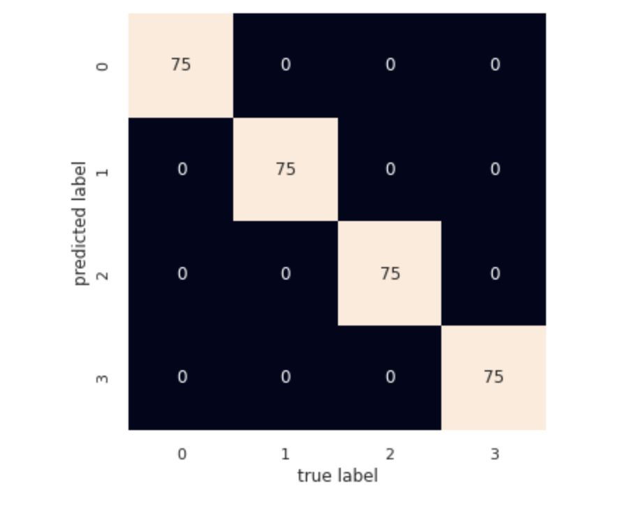

===================================

KMeans using KElbowVisualizer

## Pre-requisite
* Linux OS
* Python 3.3+
* Jupyter Notebook
* GitHub

## Steps for installation / Setup
* Open Terminal
* Run the command - git clone 
* Browse into directory (hint: command - cd assignments)
* Install any dependent libs if needed
* On successful installations of libs, run "jupyter notebook"

## Steps to execute program
* On jupyter notebook, navigate to the directory where assignments git repo was cloned in previous step
* Navigate to KMeans/
* Click on "KMeans.ipynb"
* Click on "Run" icon from the menu

## Confusion Matrix

## Which K works best
K=4 works best as accuracy is 1.0

## The best K accuracy
k=4 gives best accuracy
