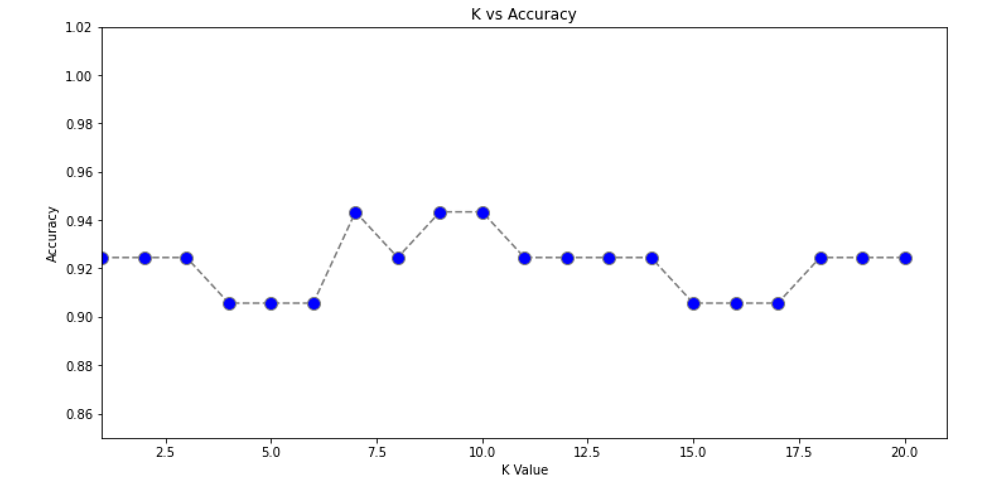
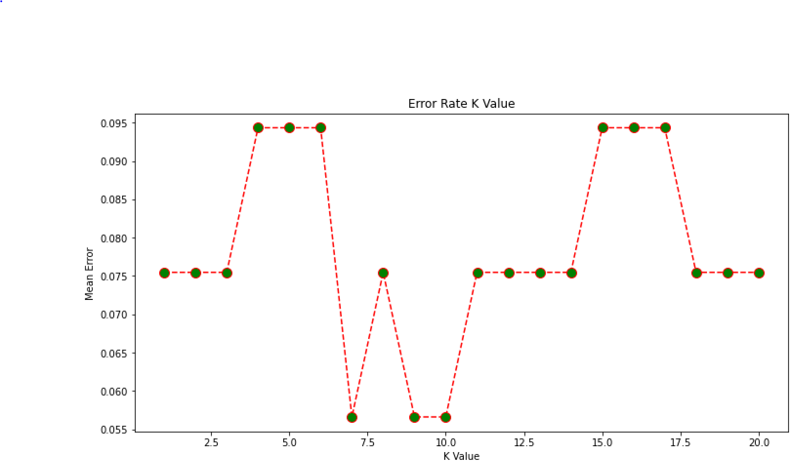

===================================

KNN using KNeighborsClassifier for K=1 to 20

## Pre-requisite
* Linux OS
* Python 3.3+
* Jupyter Notebook
* GitHub

## Steps for installation / Setup
* Open Terminal
* Run the command - git clone 
* Browse into directory (hint: command - cd assignments)
* All dependent libs are listed in dependencies.txt. 
* Execute this command to install these libs from repo root "pip3 install -r Homework_1/dependencies.txt"
* On successful installations of libs, run "jupyter notebook"

## Steps to execute program
* On jupyter notebook, navigate to the directory where assignments git repo was cloned in previous step
* Navigate to KNN/
* Click on "K-Nearest Neighbors.ipynb"
* Click on "Run" icon from the menu

## Line Chart
### Accuracy Score

### Error Score

## Which K works best
K=7 works best due to following reasons
* As per line chart, K=7 has the highest accuracy score
* As per line chart, k=7 has the lowest error score
* The optimal K value usually found is the square root of N, where N is the total number of samples. Number of samples for this program (N) = 53, which rounds down to 7
