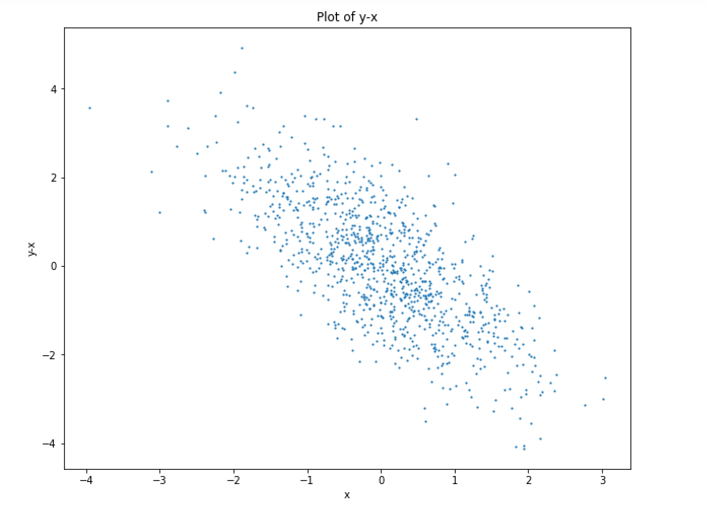
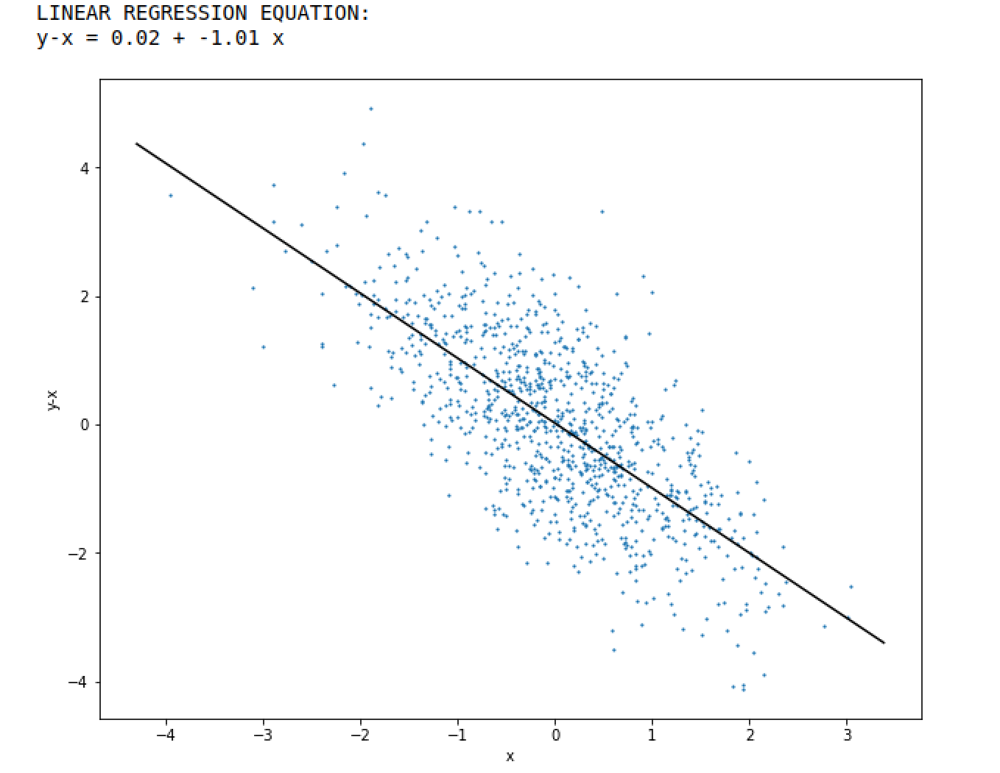

Homework #3
===================================

Regression

## Group 12 - Team Members
* Savitha Rachuri - rachuris21@students.ecu.edu
* Mohammed Azhar Khatri - khatrim21@students.ecu.edu
* Suhel Siddique - siddiques21@students.ecu.edu

## Pre-requisite
* Linux OS
* Python 3.3+
* Jupyter Notebook
* GitHub

## Steps for installation / Setup
* Open Terminal
* Run the command - git clone "https://github.com/ml-group-12/assignments.git"
* Browse into directory (hint: command - cd assignments)
* Install any dependent libs if needed
* On successful installations of libs, run "jupyter notebook"

## Steps to execute program
* On jupyter notebook, navigate to the directory where assignments git repo was cloned in previous step
* Navigate to Homework_3/
* Click on "Homework_3.ipynb"
* Click on "Run" icon from the menu

## Graphs

